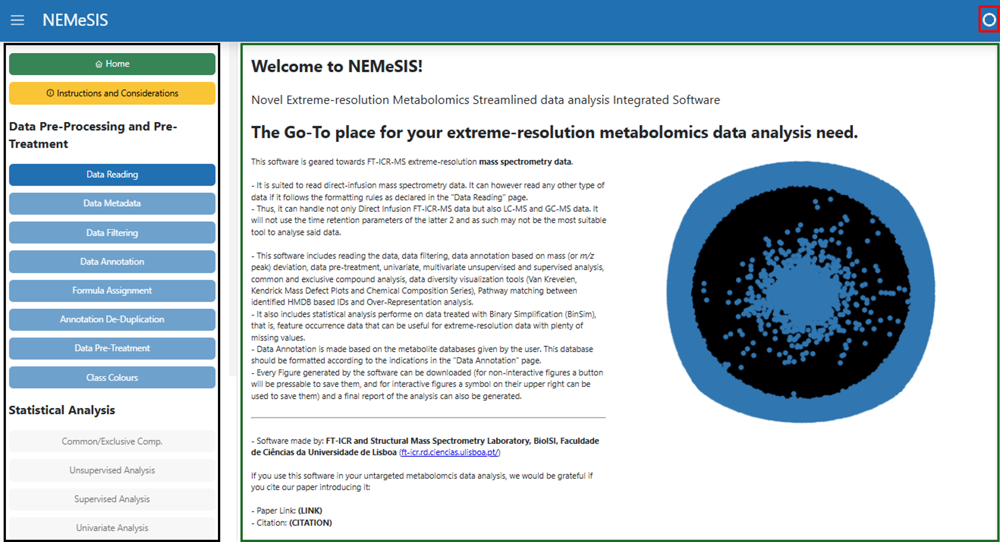
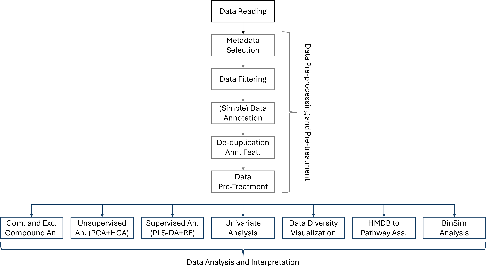
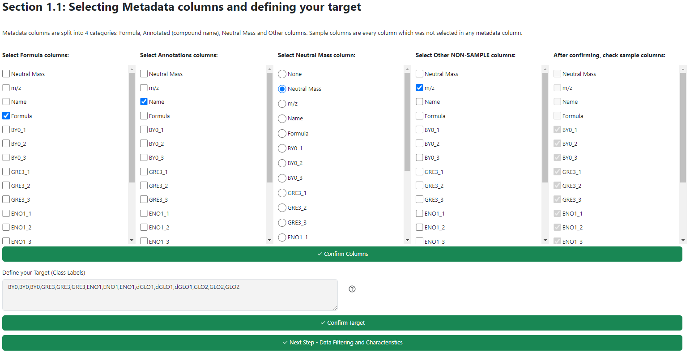
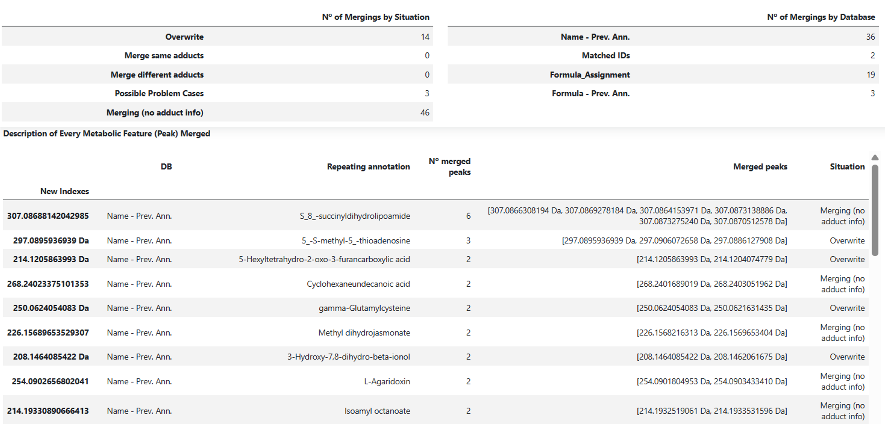
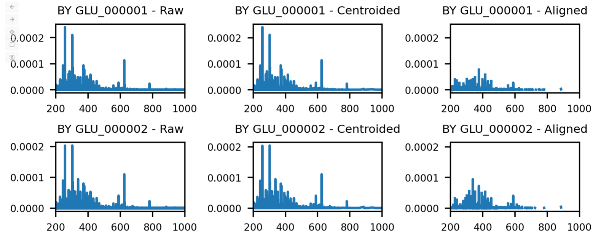

## Starting the Graphical Interface of NEMeSIS

NEMeSIS incldues a large main program to perform the analysis from Data Tables to Biological Interpretation where most of this tutorial is focused. Other than this interface, a separated Data Alignment Software capable of converting mzML raw data to mass peak lists and alignment of mass peak lists to create data tables used as input for the main NEMeSIS program. For details and instructions on the latter see [Data Alignment Software](GUI_docs.md#data-alignment-software).

## Opening NEMeSIS

To open NEMeSIS, there are multiple options. We recommend the following:

1) Open the Terminal or AnacondaPrompt (if Anaconda was not added to the PATH during installation).

2) Navigate to the NEMeSIS folder in the pc with the `cd` command (or open the terminal directly on the folder).

3) If you installed the requirements for NEMeSIS in the **NEMeSIS_env** specific environment as suggested, activate said environment with `conda activate NEMeSIS_env`.

4) Run `Interface_NEMeSIS.py` as a line code. This will open the program itself so it can be used in an internet browser (it is running locally however).

5) To close the program, return to the command line and press 'Ctrl+C'.

## Introduction to the Graphical Interface of NEMeSIS

When opening NEMeSIS, you are greeted with a page such as the one presented below that should open in your browser of choice.

Here, you can see on the on the left-hand side of the page (in a black box), you get an index-like column with buttons for every main page of the software. Most will be locked off in the beginning since they require other steps to be completed first before accessing. This is the main way to access different pages in the software. The first button (`Home`) and initial homepage of the software leads you to an introduction of what this software is and what analysis steps it includes. The second button (`Considerations and Instructions`) takes you to a few explanations and clarification on the workings of the software, which are also present here at the end of the page in [Tips and Precautions](GUI_docs.md#tips-and-precautions). From then on, we go onto the data analysis pages.

The green box marks the main section where the page currently selected appears. The red box in the upper right corner has a small ring in it. This ring will indicate to you if the program is currently computing anything. If it is, there will be a small black section going around the ring. While the program is computing, you cannot update anything else in it.

NEMeSIS is divided into 3 stages:

1. Data Input (a single page in the Data Pre-Processing and Pre-Treatment section). Image als shows steps performed by the Data Alignment Software
2. Data Pre-Processing and Pre-Treatment
3. Data Analysis and Biological Intepretation (Statistical Analysis)

Note: Independent Side Modules are only available in jupyter notebooks. See [Independent Side Modules](jupyter_docs.md#independent-side-modules) in the jupyter notebook page.

## Stage 1: Data Input

!!! info

    This section shares high similarities with the first part of the [Data Reading](jupyter_docs.md#data-reading) section of the [Get started with jupyter](jupyter_docs.md) page.

The first section of the data analysis software is data reading, that is, the data you will input to the program and thus requires a strict formatting from the files. The software accepts already data tables with the raw data of the sample having already been previously aligned. From then on, the software is capable of performing the remaining data analysis. See [Data Alignment Software](GUI_docs.md#data-alignment-software) for instructions on how to obtain these data tables using our standalone Data Alignment Software from mzML raw data or peak lists.

This formatting is exemplified in the figure below with the addition that files can either be `.csv` or `.xlsx` files. Metabolic Features should be represented in the rows, while samples and metadata should be represented in columns. 

The first column in your data must correspond to the identifier of your metabolic features, more specifically, to a mass value if possible - black box - and they should be unique (non-repeating). The name of the column will be overwritten to be `Bucket label`. If the columns are mass values capable of being intepreted as floats (numbers), then a `Mass` column in your data will be added. This column is later necessary to perform `Data Annotation` (but nothing else). You have 3 possibilities to choose from: `Neutral` where the masses in your index are taken as the neutral masses creating a `Neutral Mass` column, `m/z (Positive)` or `m/z (Negative)` where the masses are assumed to be _m/z_ values obtained in positive or negative (respectively) ionization mode creating a `Probable m/z` column.

!!! danger

    Avoid having a column named `Neutral Mass` or `m/z` in your data, since it will be overwritten.

The remaining columns are free to be any metadata you have in your data (green box) and the samples with the corresponding intensity values (purple box). If you are using LC-MS or GC-MS or any other kind of hyphenated method and have another column other than mass to characterize your features such as retention time, you can still analyse them and identify this columns as metadata but they will not be used for data annotation or any other step in the analysis.

Optionally, the first row (after the column names) of your data may include the class labels of each of your samples (orange box) that will be used to automatically generate the target (class labels) later on.

After data is read, the next step of the analysis will be unlocked (loading an example dataset to test the software is possible).

!!! info

    If you want, you can load the parameters used in a previous analysis at this stage as well. Further details about this in [Report Generation and Parameter Saving](GUI_docs.md#report-generation-and-parameter-saving).

## Stage 2: Data Pre-Processing and Pre-Treatment

The second stage of the software is the Data Pre-Processing and Pre-Treatment that includes many sub-sections: [Metadata Selection](GUI_docs.md#metadata-selection), [Data Filtering](GUI_docs.md#data-filtering), [Data Annotation](GUI_docs.md#data-annotation), [Formula Assignment](GUI_docs.md#formula-assignment), [De-Duplication of Annotated Features](GUI_docs.md#de-duplication-of-ann-features) and [Data Pre-Treatment](GUI_docs.md#data-pre-treatment).

All these sections are mandatory and are progressed and unlocked one by one in a linear fashion. You can redo previous parts of the pre-treatment. If you **change any part of the pre-treatment**, posterior pre-treatment steps and statistical analysis will immediately **be locked** and will **erase previous statistical analysis** if any has been performed. This is to avoid situations where the user wanted to change the pre-treatment but forgot to re-apply posterior pre-treatment steps. Thus, it is necessary to keep coherency.

#### Metadata Selection

Here, you will be asked to select which columns of your data are metadata (non-sample columns). If this metadata includes formula assignment or metabolite compound annotation columns, you can select them in their corresponding spots so they can be used downstream as that. Furthermore, you can select a column that contains the mass values of your metabolic features, whether it is the `Neutral Mass` or `Probable m/z` columns created in the previous section or another prepared previously that will be used for `Data Annotation` (if `None` is chosen, `Data Annotation` cannot be performed). Finally, you can select Quality Control (QC) samples that will be separated from the remaining ones (they will not be used in the statistical analysis but can be used for Quality Control Sample based Data Filtering). Other metadata will not be used in the analysis.

After selecting it, either a target will try to be inferred from the name of your samples or it will be taken from your data (if it was present). In either case, you can edit your target to your needs, before confirming it and moving to the next section.

#### Data Filtering

Data Filtering is used to _clean_ the dataset of features that appear in very few samples. You can select to perform Data Filtering by 4 different procedures.

1) **Filtering based on the number of samples each feature appears in**. This will only include features that appear in a determined number **n** of either the total samples of the dataset (`Total Samples` method) or of at least the samples of one class (`Class Samples` method). It can be used, for example to filter experimental artifacts. This **n** is referred to as the _feature filter keyword_ and can go from 1 to the number of samples in your data in the first case or to the number of samples of your least populated class in the second.

2) **Filtering based on intensity values**. This will filter metabolic features based on their intensity values as calculated by the mean or median over the samples they appear in, removing lower intensity features. A hard threshold with a set intensity value is used or a percentage based threshold where the percent lowest intensity of features are removed.

3) **Filtering based on the feature variance of Quality Control samples**. Only available if you have at least three QC samples as selected in the previous page. This will eliminate features that have high variance in the quality control samples (where they should be equal) as estimated by relative standard deviation (standard deviation / mean) above a determined threshold, since that points that they are not reproducible. Features that do not appear in the QC samples are assumed to have 0 variance.

4) **Filtering based on the feature variance of analysed samples**. This filtering is not recommended to use if you are looking for exclusive metabolic features in the classes of your datasets or if you aim to use feature occurrence data. It will filter out the lowest variance features across the samples since their intensity patterns would not be informative.

After Data Filtering, a small table detailing some characteristics of your data as well as your dataset will be shown.

#### Data Annotation

Next up, we have Data Annotation. This step is only possible if you have a Mass column as selected in the earlier section (either created in the software based on mass values provided or previously obtained) that represents the masses of the metabolites detected as numbers. This section allows to match unknown metabolic features to known compounds and metabolite, highly enhancing the possible biological interpretation.

You can skip this step by selecting annotation with _0_ databases. Or you can select 1 to 5 databases to perform independent annotations. A database must have a compound ID column, a compound name column and a compound formula column (that is used to calculate the compound theoretical mass used for annotation). To use a database, it should be on the directory where NEMeSIS is located and you must provide a series of informations such as the file name and the column identifier of the ID, name and formula of the compounds. You will also be asked for an abbreviated name of the database to use (for example, HMDB for Human Metabolome Database). If the Database contains a column with KEGG compound IDs, this information will also be conserved in the annotation if and only if the column is named 'kegg'.

After loading your desired databases, you can choose a maximum threshold of deviation between the theoretical masses of the compounds in the database and the neutral masses in the dataset. This can be a flat threshold (`Absolute Dalton Deviation`) or a parts per million based threshold (`PPM Deviation`) (1).
{ .annotate }

1. A usual value for extreme-resolution data could be a ppm deviation between 0.5 and 1 ppm.

Finally, you can decide which adducts to search by inputting the adduct name and consequent mass shift they cause on a neutral mass. This should be inputted in the following format "Adduct_Name : Mass_Shift_to_neutral_mass". As an example: "[M+H]+ : 1.007276451988935". The software automatically provides an example of common adducts to search based on if `Positive (m/z)` ([M+H]+, [M+Na]+, [M+K]+), `Negative (m/z)` ([M-H]-, [M+Cl]-) or `Neutral` ([M]) were chosen in Step 1.

With these parameters selected, you can perform the annotation. Before the annotation, all selected databases will be merged together. The annotation is made by comparing the dataset's masses with the databases. Every compound in the database that fall within the error margin threshold chosen to a given metabolite feature is annotated to that feature. Thus, very often features have multiple annotations associated (for example, every isomer in a database will be annotated if one is). This annotation is based on the fact that the mass value of a feature is not enough to differentiate and choose between different isomers. The results of the annotation of our data based on an individual database is the creation of 5 metadata columns: for each metabolic feature, one has a list of compound IDs annotated, another of compound names, another of compound formulas, another with the corresponding adducts and the last with the database where the annotated compounds were present (1). If KEGG compound IDs are detected in a database a 6th metadata column will be created with these KEGG IDs (2).
{ .annotate }

1. The lists are in the same order in the 5 columns. Thus, the 3rd compound ID in its list corresponds to the 3rd compound name in its list.
2. The KEGG ID columns are detected by their name - the name must be 'kegg'.

#### Formula Assignment

Formula Assignment is a complement to the Data Annotation performed in the step before. Data annotation provides a lot of information to annotated metabolic features but the lower number of compounds in the database leads to only a small subset of metaoblic features to be annotated. Formula assignment complements annotation by having a much wider coverage of the chemical space allowing many more formula assignments to be performed, however each is less informative individually. Thus, they complement each other to provide a fuller picture of the dataset.

!!! tip

    Data Annotation and Formula Assignment are essential for the extraction of biological information. However, if annotation and/or formula assignment have been performed outside NEMeSIS, we do not recommend them to also be applied here. Multiple sets of annotations or of formula assignments can confound the [De-Duplication of Annotated Features](GUI_docs.md#de-duplication-of-ann-features) step (next step) and posterior analysis.

Formula assignment is made here with our developed algorithm **ScoreForm** presented with detailed descriptions of the criteria and steps used available in the **preprint here**. It follows the [7 Golden Rules](https://doi.org/10.1186/1471-2105-8-105) proposed by Kind and Fiehn updated to new standards following what is observed in the chemical space of metabolites nowadays. It focuses on restricting and prioritizing formulas with elemental ratios (and number of atoms of each element) in ranges tailored to the mass of the formula itself, allowing a higher performance in formula prediction while not sacrificing formula coverage. Moreover, it is a score-based algorithm providing a relative score of confidence when there are multiple candidates for assignment of a metabolic feature. The scores and candidates are also saved within the dataset allowing the researcher to delve into the candidates and compare their relative scores for greater granularity.

Importantly, the first step of the algorithm is the creation of a Formula Database which is **performed outside the interface**. **Without creating a database, this step cannot be ran and must be skipped. The Formula Database can be created by simply running the `FormulaDatabaseCreator.ipynb` notebook once before.** The parameters in this file can also be changed to suit the Formula Database closer to the researcher's desires. The name of the files comprising the database should follow the convention of 'formulas_improved_dict{n}.csv' where _n_ is the lowest molecular mass in the file that should go from 0 to 1000 in 250 Da intervals. For example, 'formulas_improved_dict250.csv' should comprise the masses from 250-500 Da.

Parameters shared with data annotation, namely mass deviation and adducts searched must be kept the same as for data annotation so as to not introduce incompatibilities. Thus, to change these parameters, they have to be altered in the [Data Annotation](GUI_docs.md#data-annotation) page. After formula assignment, a small description of the results is shown.

!!! warning

    When choosing the name of the columns the assigned formulas will be added to, make sure it is not the same name of a pre-existing column.

!!! note

    The next version will include a greater set of parameter options to modify and finetune how the ScoreForm algorithm is applied.

#### De-Duplication of Ann. Features

Due to the proximity of mass values, the same compound (or formula) can be annotated to different metabolic features. The objective of this section is to merge metabolic features that have the same annotations or formula assignments, preventing the existence of features with the same annotations. The rationale is that, being NEMeSIS targeted to direct infusion data, the adduct of one compound should result in one monoisotopic mass and therefore metabolic peak. However, practically, an _m/z_ peak might be split between two very similar _m/z_ values. Thus, we can merge features with the same annotations. In the same way, peaks from different adducts can also be merged into one metabolic feature.

The beginning of the page will provide you a report of duplicated peaks across annotations and formula assignments you have provided (see figure below). The first columns regard to the duplications in annotations with the orange box showing the duplications from columns previously annotated before uploading data to NEMeSIS and in green the box with Matched IDs annotations performed by NEMeSIS; and the last columns correspond to duplications in formula assignments with the first (red box) corresponding to the NEMeSIS performed ScoreForm assignment and the last one (blue box) to previous formula assignments. This example shows all 4 types of possible columns to appear but **we recommend for no more than 1 annotation and 1 formula assignment column to be present in the data to simplify de-duplication and analysis.**

From this report, a decision can be made whether de-duplication (merging) of these peak will be made. The most common situations to merge is the existence of one 'main' peak with much higher intensities across the samples or the existence of peaks corresponding to multiple adducts that can be merged. More situations can also arise, including a specific situation that warrants individual attention. These are more likely when multiple annotations are considered, hence our previous recommendations. **When finding different metabolic features with the same annotation (for all columns), features are merged by keeping the highest intensity value in each sample if representing the same adduct and summed if they correspond to different adducts (1).**
{ .annotate }

1. When both cases happen at the same time, first metabolic features of the same adduct are merged by keeping the highest intensity and then different adducts are summed.

In total, 4 possible situations for merging can happen:

- **Situation 1 (Overwrite)**: Multiple metabolic features have the same annotation for all annotation databases with the highest intensity values coming all from one metabolic feature that becomes the de facto metabolic feature with others being erased (only happens when they all come from the same adduct).

- **Situation 2 (Merge Same Adducts)**: Multiple metabolic features have the same annotation (no different annotations in any annotation column) with the highest intensity coming from at least two different metabolic features and **ALL** metabolic features come from the same adduct. For each sample, the highest intensity is kept. 'Bucket Label' and the 'Mass' columns become the weighted average (based on the average intensity of the features) of all the features with the same annotation.

- **Situation 3 (Merge Different Adducts)**: Identical to Situation 2 but there is **at least one metabolic feature that comes from a different adduct**. For each sample, the highest intensity of metabolic features from the same adduct are kept. Then, the intensities of metabolic features of different adducts are summed.

- **Situation 4 (Contradictions - Possible Problem Situation)**: Multiple metabolic features have the same annotation for one annotation and different for another. Most of the time there is no issue. For example, imagine a case where we have annotated HMDB compounds and ScoreForm assigned formulas. **Scenario 1**: We find that HMDB puts two different compounds for 2 metabolic features and ScoreForm assigns the same formula. Here, it is fair to treat them as different features and this is the default behaviour. **Scenario 2**: However, rarely, there can be a case where there are more than 2 metabolic features with the same compound annotated in HMDB. This should be quite rare and it is from where the problem arises. HMDB has the same compound for 4 features and ScoreForm assigns to one of them one formula, to a second one a different formula and the last two no formula at all. What is the correct course of action?  Perhaps merging the two peaks with no annotation by ScoreForm, maybe merging those two peaks with one of those annotated by ScoreForm since they would be normally merged if not for the existence of two different ScoreForm annotations. Hence, the problem. **They should be seen on a case-by-case basis and are thus not automatically merged. These cases can be individually seen and decided upon (example below). At this point, we believe a sensible course of action may be to not merge any of these peaks together. If many of these cases occur, consider your annotations**.

From the merging of metabolic peaks, tables will appear to describe them as shown below. First, an overview of the mergings performed on the left and the mergings that each annotation led to (by order of scanning) on the right. Below, a description of every single merging is also provided.

!!! info

    It is expected for the number of mergings per annotation to decrease along annotations since most of the annotation duplications and mergings overlap. In our example, almost all mergings that would happen for the `Matched IDs` column happenned first for the `Name - Prev. Ann.` column and, therefore, did not need to be repeated.

At the end, all possible merging problems arising from **Situation 4** will also be displayed (figure below), where you can pass to the [Data Pre-Treatment](GUI_docs.md#data-pre-treatment) or decide what to do with each individual problem. **Right now, we believe a sensible course of action may be to not merge any of these peaks together and consider your annotation more closely if many of these cases occur**.

The figure below shows the example of a problem emerging from a 5-peak merging (5 peaks being merged is highly unlikely and only occurs due to the wide ppm deviation allowed for a prvious annotation made in the example dataset). Here you can select on the elft which peaks to merge. However, **these peaks cannot be incompatible**. For example, in the case shown below, despite all peaks having the same annotation in the `Name` and `Formula` columns (previous annotation) and no annotation in `Matched IDs`, they all have different annotations in the `Formula_Assignment` column. Therefore, no possible selection will allow a merging of the peaks. If for example, another peak also had no annotation in the `Formula_Assignment` column like `306.0777699814 Da`, then those two peaks could've been selected and merge (identical for if any 2 peaks had the same `Formula_Assignment` assignment). After this, a report of the individual mergings performed or not performed will be provided before moving on to the next section.

#### Data Pre-Treatment

Data Pre-Treatment is a series of successive operations that include: missing value imputation, normalizations, transformations and scaling. The only mandatory operation is missing value imputation since the existence of missing values does not allow the application of many statistical methods downstream. These procedures have the aim of highlighting relevant biological variation while reducing the effect of undesired variation ([van den Berg et al., 2006](https://doi.org/10.1186/1471-2164-7-142)) and make the values in dataset more amenable to posterior downstream analysis.

Each category has multiple different approaches available which we will present next and, since data pre-treatment highly impacts posterior data analysis, careful deliberation on the combination of pre-treatments to use is advised.

!!! danger

    Not all possible combinations of pre-treatments are viable. There are some combinations which included incompatible methods between them or with your data. As two examples, **Zero** missing value imputation cannot be used with a generalized logarithmic transformation and normalization by a reference feature cannot be used if your reference feature does not appear in **all the dataset samples**. This incompatibility will generate missing values in the data which the software will warn you about.

***Missing Value Imputation***

Missing Value Imputation aims to replace missing values in the dataset (metabolic features that do not appear in certain samples despite appearing in others) with "probable" intensity values to make possible many different statistical analysis. There are 3 types of missing values: Missed At Random (MAR), Missed Not At Random (MNAR) or Missed Completely At Random (MCAR). The methods available in this software assume the missing values are MNAR, that is, that they were missed not due to instrumental error but due to the metabolic feature being absent or in concentrations / intensities below the detection limit in that sample. Thus, these methods replace this missing values with low values below most other intensity values in the data.

| Missing Value Imputation Methods Available | Description                          |
| ------------------------------------------ | ------------------------------------ |
| Minimum of Sample                          | Replace missing values with a fraction (0 to 1) of the minimum intensity value in the corresponding sample. |
| Minimum of Feature                         | Replace missing values with a fraction (0 to 1) of the minimum intensity value in the corresponding metabolic feature. |
| Minimum of Data                            | Replace missing values with a fraction (0 to 1) of the minimum intensity value in the dataset. |
| Zero Imputation                            | Replace missing values with 0. |

***Normalization***

| Normalization Methods Available            | Description                          |
| ------------------------------------------ | ------------------------------------ |
| By Total Sum of Intensities                | Dividing each intensity by the total sum of intensities of the corresponding sample (all values between 0 and 1). |
| By a Reference Feature                     | Dividing each intensity by the intensity of the reference feature in the corresponding sample. |
| Probabilistic Quotient Normalization (PQN) | Normalization method proposed by Dieterle et al. in 2006 - see [paper here](https://doi.org/10.1021/ac051632c) for details. |
| Quantile Normalization                     | As explained by Bolstad et al. in 2003 - see [paper here](https://doi.org/10.1093/bioinformatics/19.2.185) for details. |
| None                                       | No Normalization Performed. |

!!! tip

    Besides the incompatibilities mentioned earlier, we recommend not to use Quantile Normalization when your data has a high percentage of missing values, which is more likely with direct infusion extreme-resolution data that this software aims to analyse.

***Transformation***

| Transformation Methods Available              | Description                          |
| --------------------------------------------- | ------------------------------------ |
| Generalized Logarithmic Transformation (glog) | Apply the equation: log2(y + (y2 + lambda2) /2). When lambda = 0, it equivalent to a logarithmic transformation |
| None                                          | No Transformation Performed. |

***Scaling***

| Scaling Methods Available | Description                          |
| ------------------------- | ------------------------------------ |
| Mean Centering            | $\widetilde{x}_{ij} = x_{ij} - \overline{x}_{i}$ |
| Pareto Scaling            | $\widetilde{x}_{ij} = \dfrac{x_{ij} - \overline{x}_{i}}{\sqrt{s_{i}}}$ |
| Auto Scaling              | $\widetilde{x}_{ij} = \dfrac{x_{ij} - \overline{x}_{i}}{s_{i}}$ |
| Range Scaling             | $\widetilde{x}_{ij} = \dfrac{x_{ij} - \overline{x}_{i}}{x_{i_{max}} - x_{i_{min}}}$ |
| Vast Scaling              | $\widetilde{x}_{ij} = \dfrac{x_{ij} - \overline{x}_{i}}{s_{i}}$ . $\dfrac{\overline{x}_{i}}{s_{i}}$  (associated [paper](https://doi.org/10.1016/S0003-2670(03)00094-1)) |
| Level Scaling             | $\widetilde{x}_{ij} = \dfrac{x_{ij} - \overline{x}_{i}}{\overline{x}_{i}}$ (the scaling factor can be the median of ${x}_{i}$ as an alternative)|
| None                      | No Scaling Performed. |

!!! info

    Scaling equations obtained from van den Berg et al., 2006, paper available [here](https://doi.org/10.1186/1471-2164-7-142).

After Data Pre-Treatment, you will have the option to download the generated tables in different stages:

- Untreated data after data annotation - `annotated_df.csv`
- Treated intensity data without metadata - `treated_df.csv`.
- Treated intensity data with metadata - `complete_treated_df.csv`.

Furthermore, a series of extra files starting with **Export** will also be generated. These files can then be moved to the NEMeSIS folder and used as input for the [Independent Side Modules](jupyter_docs.md#independent-side-modules). These are:

- `Export_TreatedData.xlsx` - Excel with 4 sheets, one containing the normalized data (without missing value imputation, transformation or scaling) with metadata, another the treated intensity data without metadata, another with the dataset treated with Binary Simplification (or Spectral Digitalization) method and the last with the treated values after missing value imputation and normalization (but before transformation and scaling).
- `Export_Target.txt` - File containing the class labels (target) of the dataset's samples in the same order as they appear in the dataset.
- `Export_TreatedData.pickle` - Treated intensity data without metadata in pickle format to guarantee the 'Bucket Labels' suffer no changes (roundings).
- `Export_ProcData.pickle` - Normalized data (without missing value imputation, transformation or scaling) with metadata in pickle format to guarantee the 'Bucket Labels' suffer no changes (roundings).

After moving from this page, you will be able to select a colour to represent each of the classes in the studied dataset before moving on to the [Data Analysis and Interpretation](jupyter_docs.md#data-analysis-and-interpretation) (Statistical Analysis) step. Futhermore, at this stage, the parameters used for pre-processing and pre-treatment can be saved as a json that can be loaded back in the Data Reading page in subsequent analysis. This will be automatically saved on the NEMeSIS folder.

## Stage 3: Data Analysis and Interpretation

The third and final stage of the software is the Data Analysis and Interpretation (Statistical Analysis) that also includes many sub-sections: [Common and Exclusive Compound Analysis](GUI_docs.md#com-and-exc-compound-analysis), [Unsupervised Analysis](GUI_docs.md#unsupervised-analysis), [Supervised Analysis](GUI_docs.md#supervised-analysis), [Univariate Analysis](GUI_docs.md#univariate-analysis), [Data Diversity Visualization](GUI_docs.md#data-diversity-visualization), [HMDB based Pathway Analysis](GUI_docs.md#hmdb-based-pathway-analysis), [BinSim Treated Data Analysis](GUI_docs.md#binsim-treated-data-analysis) and a [Compound Search Tool](GUI_docs.md#compound-search-tool).

Almost all these sections are independent of one another and can be performed in any desired order based on the analyses objective. The exception is certain parts of the [HMDB based Pathway Analysis](GUI_docs.md#hmdb-based-pathway-analysis) section that requires either [Supervised Analysis](GUI_docs.md#supervised-analysis) or [Univariate Analysis](GUI_docs.md#univariate-analysis) to have been performed first.

These steps have different purposes to interpret the analysed data, giving different perspectives on it.

!!! info

    During this stage, analysis results expressed as images can either be **static** (made using matplotlib python package)or **interactive** (made using plotly). For **static** figures, a nearby button with 'save as png' text will always be nearby so the figure can be downloaded exactly as it is shown. For **interactive** figures (see image below), when hovering over them, a series of options appears in the top right. The leftmost of these options allows to save the figure exactly as it is currently shown (red box in image below). Interactive figures allows to hover over individual points and obtain information, to zoom in on specific regions, etc. To return the default view point, the autoscale button can be pressed (green box in image below).

#### Com. and Exc. Compound Analysis

The Common and Exclusive Compound Analysis when computed provides three types of outputs that can be viewed by selecting the shown tabs. They allow to see possible important compounds that are biomarker like as well as the the general number of metabolic features by class and common to all classes. It also allows to see if a subset of classes has a high number of metabolic features specific to them.

The **Overview** section includes a brief description of the number of compounds (and annotated compounds) that each biological class has, that are exclusive to each of them and that are common to all of them. This data can also be downloaded as a table. Furthermore, you may select a subset of the classes to see all associated metabolic features to those classes or only those that are exclusive to those classes. This data subset can also be saved as a dataframe.

The **Venn Diagram** section, as the name entails, shown a Venn Diagram of the metabolic features. This Diagram is built with the `venn.py` file originally provided in [https://github.com/tctianchi/pyvenn/blob/master/venn.py](https://github.com/tctianchi/pyvenn/blob/master/venn.py) and used according to its license.

The **Intersection Plot** section shows intersection plots considering all metabolic features of the data and only the features with annotated data.

Venn Diagrams and Intersection Plots are static non-interactive images.

!!! info

    Venn Diagrams and Intersection Plots will not be computed and drawn if the dataset has more than 6 different classes since the observation of the data becomes less meaningful.

#### Unsupervised Analysis

Multivariate Unsupervised Analysis methods included in its corresponding page are Principal Component Analysis (PCA) and Hierarchical Clustering Analysis (HCA). Since they are used to observe the intrinsic patterns and structure in the data, they provide mostly figures to describe the analysed data.

The **PCA** section can show 2D and 3D projection of the samples in 2 or 3 PCA components (these components can be chosen) as well as the cumulative explained variance by component and a 2D Scatter plot of PCA projections of up to the first 6 components. All these figures are interactive.

The **HCA** section contains the dendrogram result as a static image that can e downloaded. Changes to the parameters will immediately cause an update to the dendrogram.

#### Supervised Analysis

Multivariate Supervised Analysis methods included in its corresponding page are Partial Least Squares - Discriminant Analysis (PLS-DA) and Random Forest (RF). They are used to build classifier models based on stratified cross validation schemes and obtain a list of important metabolites to build these classifiers and discriminate between classes.

Both **PLS-DA** and **RF** follow a very similar organization on their corresponding tabs.

They start with an optimization of specific parameters for each one. For **PLS-DA**, this is an optimization of the number of components or latent variables which is an essential parameter. This is made by evaluating the $Q^{2}$ (1) and the $R^{2}$ (2) (see tip below) when fitting a PLS model to the data from a chosen initial to final number of components with a stratified cross validation scheme (see warning below). For **RF**, it is an optimization of the number of trees by observing RF accuracy of models built between specified numbers of trees with a stratified cross validation scheme.
{ .annotate}

1. Mean squared error of PLS predictions based on **test samples**.

2. Mean squared error of PLS predictions based on **training samples**.

!!! warning

    The maximum number of components chosen cannot be higher than the number of samples that will train a model minus 1. For example, if you have 15 samples and a 3-fold cross-validation each fold will have 5 samples. A training set will be comprised of two of those folds thus it will have 10 samples, thus the number of components cannot be higher than 9. Another example if you have 22 samples and 5 folds, the folds will have 4/4/4/5/5 samples each. A training set will have four of these folds and the minimum sum of them is 4+4+4+5-1=16, thus it cannot be higher than 16.

!!! tip

    When optimizing **PLS-DA**, the chosen number of components should be the number where **$Q^{2}$ stops increasing**.

    - **$Q^{2}$** will increase until a certain number of components that should be chosen. Then it usually stabilizes but from a certain point it might start to decrease which would mean the model is overfitting (less generalizable to the test samples).
    - **$R^{2}$** will be higher than $Q^{2}$ but it should not be used to choose the number of components. This metric always increases with more components (estimation errors might lead to temporary decreases) which means it will eventually overfit the model.

    When optimizing **RF**, the usual pattern observed is an increase in accuracy with an increase of the number of trees until it stabilizes and fluctuates around a certain value. Since RF are somewhat resistant to overfitting, the value chosen will be one where the accuracy has stopped increasing but not too high as to make the model training too slow.

After optimization, the models can be trained allowing the modification of key parameters. The number of times to repeat analysis parameter exists as more repetition will allow a better estimation of model peerformance and feature importance at a cost of time of running. They will output a table summarizing model performance and a table with an ordered list of important metabolic features to build the classifier model as estimated by either Variable Importance in Projection (VIP) scores or X-Weights for PLS-DA and by Gini Importance for RF. The latter table can be downloaded.

!!! info

    Metabolic Feature importances estimated are calculated for each fold and each repetition of the analysis and averaged.

    VIP Scores are calculated based on Keiron Teilo O'Shea provided code in [https://www.researchgate.net/post/How-can-I-compute-Variable-Importance-in-Projection-VIP-in-Partial-Least-Squares-PLS](https://www.researchgate.net/post/How-can-I-compute-Variable-Importance-in-Projection-VIP-in-Partial-Least-Squares-PLS). This calculation can be slow when you have a high number of features.

Besides model fitting, **Permutation tests** for model validation and **Receiver Operating Characteristic (ROC) Curve** are available.

ROC Curves plot the True Positive Rate by the False Positive Rate and thus geared towards 2-class datasets (1). For multiclass cases (more than 2 classes), a ROC curve will be computed for each class considered as the positive by fitting a "1vsAll" model, that is, the class of each sample is either the current positive class or "Other". Thus, there will likely be many more negative samples than positive samples in each case, greatly increasing the importance of the latter for the curve of each class.
{ .annotate }

1. One class has to be considered as the positive class.

!!! info

    Permutation tests are slow to be computed and can take quite a few minutes depending on the number of permutations. For an initial analysis of the data, it may be skipped.

    Permutation test p-value is calculated as: $p-value = \dfrac{1 + n}{N}$

    Where **_n_** is number of times permuted model has better performance that non-permuted model and **_N_** is the total number of permutations.

#### Univariate Analysis

Univariate Analysis page includes **1v1 Univariate Analysis** and **Multiclass Univariate Analysis**. It allows to detect metabolites that individually have a significant difference between the tested classes and can thus be discriminant. Each metabolite in the dataset is tested individually and thus, this does not account for any interaction between metabolites as multivariate analysis does (and is expected in metabolites within a biological system).

**1v1 Univariate Analysis** includes also a **Fold-Change analysis**. When there are more than 2 classes, a control and test class can be chosen. In this case, the samples respective to the 2 chosen classes will be selected from the non-treated data (after annotation). Data filtering (Filter 1 only) and pre-treatment will be performed the same way it was done on the complete dataset before performing unsupervised analysis (starting from the dataset after data filtering, annotation and de-duplication) (1). In case of filtering based on the total number of samples a feature appears in, the number used on the full dataset is converted to percentage-based and then a new number is calculated based on the number of samples of the control and test class, which is then rounded up.
{ .annotate }

1. We cannot start from the completely full dataset since we have no annotations associated with it despite the fact that, when using total number of samples based data filtering, there could be some fatures that were initially filtered out that could remain in the dataset. E.g. if you choose a minimum of 4 samples to appear in a 15-sample 5-class dataset. When performing univariate analysis on 2 classes that have a total of 6 samples, the minimum 5 samples would be transformed to a minimum of 2 samples in the 6-sample subset (4 out of 15 represents 26.67% of samples, which is 1.6 out of 6 samples rounded up to 2). There could be features that appear in 2 of these 6 samples but that did not appear in 4 of the original 15 samples and were thus previously removed from the dataset. These features **stay removed**.

The types of univariate test can be chosen (t-test, Mann-Whitney test, consider variances equal or not) as well as the thresholds for significancy on both _p_-values (1) and fold-change. Fold-change is calculated using the values after missing value imputation and normalization (but before transformation and scaling) as to avoid calculations with negative values. Thus, fold-change calculation is severely affected by a high number of missing values and is not suited to this type of data where the values have to be taken with a grain (or multiple grains that are actually more like rocks than grains) of salt (see tip below).
{ .annotate }

1. _P_-values are adjusted with Benjamini-Hochberg multiple test correction.

!!! tip

    Selecting the Fold-change threshold to 1 will nullify it, essentially skipping the threshold. This should be used when the dataset has a high number of missing values.

1v1 Univariate analysis results include a downloadable table with all _p_-values and fold changes, a volcano plot and a clustermap that can show the top most significant features or all significant features below a determined _p_-value threshold. Finally, for multiclass datasets, you can also obtain the intersection of significant metabolites against multiple possible test classes.

**Multiclass Univariate Analysis** can only be performed when the dataset has **more than 2 classes**. All classes are tested simultaneously and results show significant metabolites considering all samples not possible for 1v1 analysis. On the other hand, no fold-change can be calculated or volcano plot drawn. The test performed can be chosen between the parametric **ANOVA** and non-parametric **Kruskal-Wallis test**.

Multiclass  Univariate analysis results include a downloadable table with all _p_-values and a clustermap that can show the top most significant features or all significant features below a determined _p_-value threshold. This clustermap can show the groupings of samples and also of metabolic features and their intensity pattern trends.

#### Data Diversity Visualization

Data Diversity Visualization allows to see the chemical diversity in different ways of your dataset. The section presents three types of plots: **Van Krevelen Plots**, **Kendrick Mass Defect Plots** and **Chemical Composition Series** plots. All these are computed when pressing the button at the top of the page and can be accessed by clicking their respective tab. Each has multiple options that allows to tune the figure. An essential parameter common to all 3 plots is which **columns containing formulas** to consider whether it is from data annotation, formula assignment or previous annotations and formula assignments performed outside NEMeSIS. Multiple can be selected to consider multiple annotations (each plot deals with multiple annotations in their own way) but **at least one column must be selected.**

**Van Krevelen Plots** are drawn one for each class considering the metabolites annotated in the samples of each class. If multiple formulas can be assigned to a metabolite whether within the same database annotation or different, they are both considered and plotted.

**Kendrick Mass Defect Plots** are drawn one for each class considering the metabolic features detected in the samples of each class.The colour of each feature is based on its chemical composition series. If multiple formulas can be assigned to a metabolite **AND** they do not belong to the same chemical composition series, they get assigned as **'Ambiguous'**.

In **Chemical Composition Series**, if multiple formulas can be assigned to the same metabolic feature, whether within the same annotation made or between different annotations, each one will be counted. That is, if a feature has 3 possible formulas, 2 belonging to the 'CHO' series and another to the 'CHOP' series; then 2 formulas will be added to the 'CHO' series and 1 to the 'CHOP' series. Thus, we are considering that the 3 elemental formulas are represented by that feature (probably an overestimation). To provide an idea of how extensive this effect is, a description is also provided before the plot detailing how many formulas are being considered for each class and from how many different features they came from.

!!! bug

    Randomly, in some Kendrick Mass Defect Plots, points may have a bigger size than in other plots despite dot size being parametrized the same in both cases.

#### HMDB based Pathway Analysis

**HMDB based Pathway Analysis** page can be divided into 4 separate and distinct sections:

- Pathway Assignment (HMDB Annotation)
- KEGG Colour Mapping
- Pathway Over-Representation Analysis (based on HMDB IDs)
- Mapping SMPDB Pathways (based on HMDB IDs)

Three of these sections require HMDB annotation while the KEGG Colour Mapping requires that only 2 classes are present in the dataset.

##### Pathway Assignment (HMDB Annotation)

This section matches known metabolic pathways to HMDB annotations (1) with 55872 HMDB compounds having at least 1 associated pathway. For matching, a column with HMDB identifiers must exist. The identifiers should have 7 numbers after HMDB (e.g. 'HMDB0000001'). The output gives the HMDB IDs and annotation names as index in a DataFrame and the name and id of the pathways that they belong to.
{ .annotate }

1. Only matched to HMDB and the abbreviation of the database should be HMDB.

Moreover, a specific search of the associated pathways of an HMDB identifier in the RAMP database can be performed in the `HMDB ID Pathway Searching Section`, independent if that compound was annotated in the studied data.

!!! note

    Matching is performed based on a file created from the [RAMP database](https://academic.oup.com/bioinformatics/article/39/1/btac726/6827287) ([https://rampdb.nih.gov/](https://rampdb.nih.gov/)), which are an aggregation of pathways from multiple sources: HMDB, Reactome, WikiPathways and KEGG.

##### KEGG Colour Mapping

This section extracts every KEGG compound ID annotated to the dataset to a downloaded file containing a list with only the KEGG identifiers and with a colour associated with them based on metabolite presence in classes. This file can then be used as input in the KEGG website [here](https://www.genome.jp/kegg/mapper/color.html).

To perform this mapping, **2 conditions must be fulfilled**:

**1)** Dataset must only have 2 classes (not available for more than 2).

**2)** A `Matched KEGGs` column might exist. This column can be metadata before previously included in the dataset or can be generated in this software during Data Annotation if **at least one of the databases used for annotation has a column with the name `kegg` (with no capitalization)** which will create the Matched KEGGs column.

##### Pathway Over-Representation Analysis (based on HMDB IDs)

This section uses the pathway mapping in the **Pathway Assignment (HMDB Annotation)** section to perform an over-representation analysis and observe which pathways are over-represented. Parameters to choose include, the minimum number of metabolites that a pathway must have in the database to be considered and the minimum number of metabolites detected in the studied dataset of a pathway for that pathway to be considered in the analysis; the background set to use; and the metric to select the set of 'significant' metabolites and corresponding threshold.

!!! info

    Multiple metabolic features with the same annotation will be considered as individual entries. Metabolic features that have multiple annotations that could correspond to multiple metabolites in the same pathway will be counted as a single metabolite. So, analysis of the relevant pathways should be performed.

The background set can be chosen between restricting to the number of `HMDB annotated metabolites in the dataset with associated pathways` or considering `All HMDB metabolites in the pathway database` (currently not implemented). The background set to choose is critical. If the pathway database is used as background, most metabolic pathways will appear as significant by 'common _p_-values' even after multiple testing correction and very general pathways with more metabolites such as 'Metabolism' or 'Biochemical pathways: part I' or 'Transport of small molecules' have a good chance of appearing as significant. Thus, pathways with multiple metabolites annotated that constitute a decent part of the pathway should be looked at more carefully. If the `HMDB annotated metabolites in the dataset with associated pathways` are used as the background, this conservative approach makes it more complicated for any pathway to be considered significant but there is less bias per pathway. In this case, we recommend looking not only at the number of significant and detected metabolites in the pathway but also to the overall number of metabolites in the pathway (in the database), which is included in the output table.

There are 4 metrics available to select the significant metabolites (have to have associated at least 1 pathway). In each case, it will only work if the corresponding methodology has been previously ran.

- **RF Gini Importance** - Threshold is the top % of ranks considered significant (e.g. 0.20 for 20%).
- **PLS-DA Feat. Importance** - Threshold is the top % of ranks considered significant if below 1 (e.g. 0.20 for 20%) or the threshold for importance if higher or equal to 1 (should only be used for VIP Scores) - **Default**.
- **1v1 Univariate Analysis** - Threshold is the maximum adjusted (for multiple test correction) _p_-value from the univariate analysis (e.g. 0.05 for adjusted _p_-values under 0.05). The test class is the class chosen as test during univariate analysis.
- **Multiclass Univariate Analysis** - Threshold is the maximum adjusted (for multiple test correction) _p_-value from the multiclass univariate analysis (e.g. 0.05 for adjusted _p_-values under 0.05).

##### Mapping SMPDB Pathways (based on HMDB IDs)

This section uses the pathway mapping in the **Pathway Assignment (HMDB Annotation)** section and the SMPDB pathway database to output a representation of a pathway based on the reactions associated with that pathway in SMPDB (1). This mapping is restricted to SMPDB metabolic pathways (2).
{ .annotate }

1. SMPDB and the RAMP database are not always identical even when referring to SMPDB pathways. For example, NAD is associated with reactions in Galactose metabolism but it is not included in the RAMP database as a Galactose metabolism metabolite.

2. SMPDB includes many pathways and only around half of them are designated as metabolic. Others such as disease pathways or signalling pathways are not able to be mapped currently.

!!! note

    This section will be improved in the next version to include a greater array of pathways.

#### BinSim Treated Data Analysis

This section and page uses data treated with Binary Simplification (BinSim) or Spectral Digitalization to perform the same analysis as it is performed for the traditionally treated data in the Unsupervised and Supervised Analysis pages. Thus, all instructions and indications are for the use of this method is equal to those pages.

BinSim ([paper here](https://doi.org/10.3390/metabo11110788)) was a method developed in our FT-ICR-MS-Lisboa laboratory group. It is an alternative to traditional intensity based pre-treatments that focuses on feature occurrence instead of intensity offering complementary information. BinSim is particularly effective for extreme-resolution data such as FT-ICR-MS data that has a lot of missing values and can more closely detect the set of metabolites present in a sample. Feature occurrence tends to be more reproducible than intensity values. The set of metabolites detected is characteristic of a biological system and can be used for discrimination.

!!! info

    BinSim consists of transforming all **intensity values** present in the data matrix to **1** (metabolic features present in the data) and all **missing values** to **0** (metabolic features absent from the data).

#### Compound Search Tool

With this search tool, you can localize a metabolic feature of interest in your dataset by its index value (`Bucket label`), its name (by searching all annotation columns either selected as annotation or made during analysis), formula (by searching all formula assignment columns) or neutral mass (by searching the `Neutral Mass` column if it exists). A series of bar plots and box plots as shown below will then be computed to show the variation of the metabolic feature between samples and classes.

!!! info

    The values shown are obtained from the original data inputted with only normalization (the one chosen in Data Pre-Treatment being applied). No Missing Value Imputation or posterior parts of the Data Pre-Treatment are applied.

## Report Generation and Parameter Saving

The graphical interface offers two different approaches to save your analysis made besides the tables and figures you can download during the analysis. These are the report generation function and the parameter saving and loading function.

The report generation creates a folder with a user chosen name. This folder contains a main read-only word .docx file and a myriad of images, interactive figures and tables that support the report. The report includes all of the data reading and data pre-processing and pre-treatment stages and includes the statistical analyses chosen by the user in the corresponding page. When generating the report, a pop-up will appear confirming if there were issues or not in creating the report. The report attempts to describe the analysis made including all the relevant parameters used for the current analysis (1). Furthermore, these parameters are also used for the name of the different figures and tables generated.
{ .annotate }

1. If the parameters selected were changed after the analysis is made and the analysis was not redone, then the parameters in the report should still be the ones originally used in the analysis.

!!! note

    If you find a mistake in the generated report, such as a parameter used in the analysis not being the one that is in the report or in the associated figures, please inform us through [https://github.com/fticr-sms/Metabolomics_DataAnalysis_Pipeline/issues](https://github.com/fticr-sms/Metabolomics_DataAnalysis_Pipeline/issues). We would greatly appreciate so we can iron out any loose ends and problems with the software.

Parameter saving is a function that specifically aims to save the **currently used parameters** in the analysis for future use on another analysis. It is available at two different locations in the interface: at the end of the data pre-processing and pre-treatment stages and in the report generation page. The former only saves parameters regarding the data pre-processing and pre-treatment steps while the latter saves all currently used parameters in the software. Although most more significant parameters are saved, there are some that cannot be saved since they are very specific to the dataset currently under analysis. A few examples are the metadata columns selected or the control/test class used in Univariate Analysis.

The idea behind parameter saving is that you can load in these parameters and the `Data Reading` page of the software to use in other posterior analysis. Furthermore, when loading in parameters, there are some parameters that might not be applicable to the current case such as the feature used in Normalization by a Reference Feature or the minimum number of samples used in data filtering. For these cases, a check will be made to see if they can be used and if not, the default value will remain.

!!! warning

    Some parameters are saved but should still always be adapted based on the dataset analysed. A case and point is that of the number of components used for building PLS-DA models. This number highly affects the performance of the models and is characteristic of the dataset used. Thus, it should always be adapted to the current dataset. Other parameters such as pre-treatment related can be used on a standard preferred workflow independent of the dataset analysed.

!!! info

    Within the saved parameters, there are some that are saved based on what is currently present in the program and not what was originally used for the analysis: these are the methods used for the common and exclusive compound analysis, the minimum and maximum number of components used for optimization of the PLS-DA, the model performance evaluation metrice used, the dpi of the permutation figure and number of iterations used in the ROC analysis of the PLS-DA section (for both intensity treated data and BinSim treated data) and the model performance evaluation metrics used and the dpi of the permutation figure of the Random Forest section (for both intensity treated data and BinSim treated data).

## Closing and Resetting the Software

To close the program, we recommend going to the **terminal / command line** tab that opened when you opened the software and closing it, which will terminate the program. Closing the software tab in your browser without closing the terminal will keep the program running in the background.

If you want to redo your analysis with another dataset, you may use the `RESET` button available at the end of the index on the left-hand side. This will reset all your current analysis and parameters chosen. A similar effect but with a softer reset happens when you change a parameter in any of the pre-processing or pre-treatment stages, however you will not be able to read another dataset until you perform a full reset of the software.

!!! bug

    After resetting the software once using the `RESET` button, when clicking it again, the window pane to confirm the reset might not appear. To fix this issue, refresh the image and it should appear once again.

## Data Alignment Software

This standalone GUI interface is used to transform either mass lists or mzML data into 2D aligned sample tables that can be used as input for the main NEMeSIS software. This is geared to the pre-processing of **direct-infusion mass spectrometry data**. As such, this software has two main purposes:

1) Convert mzML file data into mass values and intensity lists - [Converting Spectral mzML raw data](GUI_docs.md#converting-spectral-mzml-raw-data).

2) Perform Data Alignment on mass values and intensity lists to generate 2D aligned sample tables, that can be exported and used as inputs for NEMeSIS - [Data Alignment](GUI_docs.md#data-alignment).

Moreover, in case the original data was mzML, it also allows to visualize the raw and aligned spectra for the researcher to observe the quality of the alignment - [Spectra Visualization](GUI_docs.md#spectra-visualization).

#### Inputting Data

Input files for the alignment should be placed in the `Files_To_Align` folder within the NEMeSIS folder. These files will be shown and selectable at the beginning of the software. You can select files either to select to go to [Converting Spectral mzML raw data](GUI_docs.md#converting-spectral-mzml-raw-data) or to pass directly to [Data Alignment](GUI_docs.md#data-alignment) when you already have your mass lists. The program will recognize this by whether you select one or multiple files:

- For submitting **mass lists with intensity values to be aligned**, the software will expect a **single Excel (`.xlsx` or `.xls`) file**. If more than one file is passed, it will assume it is spectral raw data and if the format is not .xlsx or .xls, it will not be able to read the file. An example image of the formatting of this file is shown below. It should have **one sample per Excel sheet**; the **name of the Excel sheet should correspond to the sample name** (orange box); each sheet should have in its **first column the mass values** (m/z, neutral mass or equivalent) and in its **second column the corresponding intensity values**; and finally, the first row should have the name of the two columns, for example, 'm/z' and 'I' (this name should be consistent between samples if possible). The example file `example_samples_to_align.xlsx` is available in the `Files_To_Align` folder as guidance.

- For submitting **spectral mzML raw data to convert and align**, the software will expect **multiple mzML files**. For the software to assume that mzML conversion is required, multiple files must be passed all in mzML format. Converting spectral raw data into the open mzML format can be done using freely available tools such as Proteowizard's [MSConvert](https://proteowizard.sourceforge.io/download.html).

#### Converting Spectral mzML raw data

This section of the software only appears if **mzML files** are detected in the data input. Here, these files in open mzML format can be converted into _m/z_ peak lists so data alignment can be performed. For this purpose, the [pyopenms](https://pyopenms.readthedocs.io/en/latest/) Python package is used. A series of parameters that can be changed to optimize conversion are available to be chosen with special attention to the `Minimal signal-to-noise ratio for a peak to be picked` parameter as crucial. Explanations of each parameter are shown with extensive documentation is present in [https://openms.de/current_doxygen/html/classOpenMS_1_1PeakPickerHiRes.html](https://openms.de/current_doxygen/html/classOpenMS_1_1PeakPickerHiRes.html). The description from the link is also near every parameter with a tooltip. Credit to pyopenms devs.

When pressing the button for conversion, each spectra will be converted giving a small description of the number of raw and centroided signals. After finishing, you will be prompted to download the results, which is required for data alignment. This exports two files, a word document with a small description of the conversion and an excel file with the mass peak lists in the formatting already required for data alignment.

#### Data Alignment

This section of the software either appears after a **single Excel file** is detected in the input or after mzML spectra raw data conversion and peak list saving. The data alignment performed is made using the `align` function from the [Metabolinks](https://pypi.org/project/metabolinks/) Python package (developed in the group). It uses 2 parameters: the **`PPM Deviation Tolerance`** that defines the maximum tolerance (in parts per million) to group metabolic features from different samples together and the **`Minimum Sample Number Appearance`** that defines the minimum number of samples a metabolic feature must appear in to be kept in the final aligned dataset.

After alignment, a short description of the alignment process will be shown as well as the aligned dataset (if this aligned dataset is large, only the first 10 000 metabolic features will be shown). The dataset and an abridged description of the metabolic feature alignments can be saved. The aligned dataset can be directly used in the NEMeSIS software (GUI or jupyter notebook versions).

#### Spectra Visualization

!!! info

    This section shares high similarities with the first part of the [Spectra Visualization](jupyter_docs.md#spectra-visualization) section of the [Get started with jupyter](jupyter_docs.md) page.

This section of the software appears after **data alignment** is performed **if the original files were mzML raw data**. The objective is to visualize the quality of the spectral data processing by observing the raw, centroided (after spectral processing) and aligned (after data alignment) spectra in interactive graphs of a few samples simultaneously. They are interactive so close ups can be selected for each graph. This allows to observe the genral shape of peaks that were kept through the process and which were discarded and to see if the quality of the aligned spectra is as desired or expected.

The image below shows an example. You can choose which samples to see, if the spectra values should be normalized (1), and which mass ranges to plot initially.
{ .annotate }

1. Normalization in the raw, centroided and aligned spectra is made by dividing their intensities the sum of all intensities in the **raw data** specifically.

!!! warning

    Spectra contain a very large number of points which combined to their interactive nature, make it heavy resource demanding for the software and the computer. Hence, although it depends on the computer available, we do not recommend selecting more than 3-4 samples simultaneously. Moreover, it may take a few seconds until the spectra are fully operational.

## Tips and Precautions

!!! note

    This section is nearly identical to the `Instructions and Considerations` page of the NEMeSIS software.

Here, we will go through some general considerations to have while using this software by describing how it works and some of the currently known issues overall that exist. Furthermore, if you encounter an issue or problem with the software feel free to inform us at [https://github.com/fticr-sms/Metabolomics_DataAnalysis_Pipeline/issues/new](https://github.com/fticr-sms/Metabolomics_DataAnalysis_Pipeline/issues/new). If you feel some parts are underexplained or cannot be intuitively grasped, please also inform us so we can improve the descriptions provided.

**General Considerations to Have**

- While there is an effort for figures and tables produced that can be downloaded to have the relevant parameters used to build them in the name, it is a good practice to keep in mind what parameters were used to make these figures and tables, especially those that do not update with every parameter change to safeguard possible errors that may arise in the filenames generated.

- All tables and figures are saved in the `Downloads` folder. Interactive figures are downloaded using the toolbar that appears at the top right of the figure when hovering over it. Non-interactive figures are saved using an available button in the software. The generated report folder is put on the current working directory, that is, the folder where NEMeSIS is.

- When you start running something there is not a way to stop the process. You can observe if the program is running by observing the little circle on the top right. If there is something currently running it will have this aspect: . Otherwise, it will have this aspect .

- Resetting the program will reset all your variables and previously performed analysis.

**Possible Problems and Suggested Fixes**

- A rare bug that occurs when running the program is the de-formatting of the pages that can happen when you go back and forth between different pages causing artifacts of different pages or empty spaces before the pages to show up. We currently believe this is an issue with the panel package we are basing this software on. This can be mostly solved by refreshing the page in the browser to reset the layout of the page. However, do not use this trick on the common and exclusive compound page since this has a small chance to make the sidebar to navigate the software disappear, rendering it unoperable and needing to be closed and opened again.

- Another issue of the same type is the reset floatpanel not appearing when pressing it the 2nd time. It is also fixed by refreshing.

- Do not mash the buttons many times, it may buffer the clicks. See first on the upper right if the program is running or not.

- Other known issues have smaller consequences and affect specific pages. When they exist, a little note in bold will indicate the problem at the beginning of the corresponding page.

**Performance of the Different Parts of the Program**

- The program generally runs smoothly and quickly with low latency. The exceptions are the very first page when data reading which can slow down the program for a few seconds as well as some parts when certain analysis such as PLS-DA or Random Forest finish and the page layout is updated with the results.

- The possible slow downs and time of analysis is also dependent on the size of the dataset. The bigger the dataset to be analyzed, the slower the analysis is and vice-versa. Formula assignment or calculating VIP scores for example is heavily dependent on dataset size.